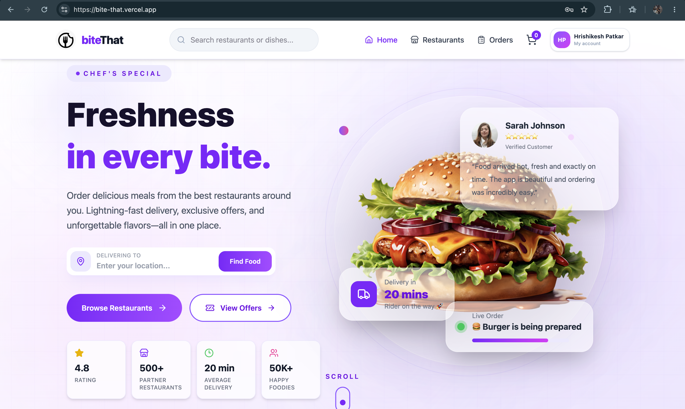
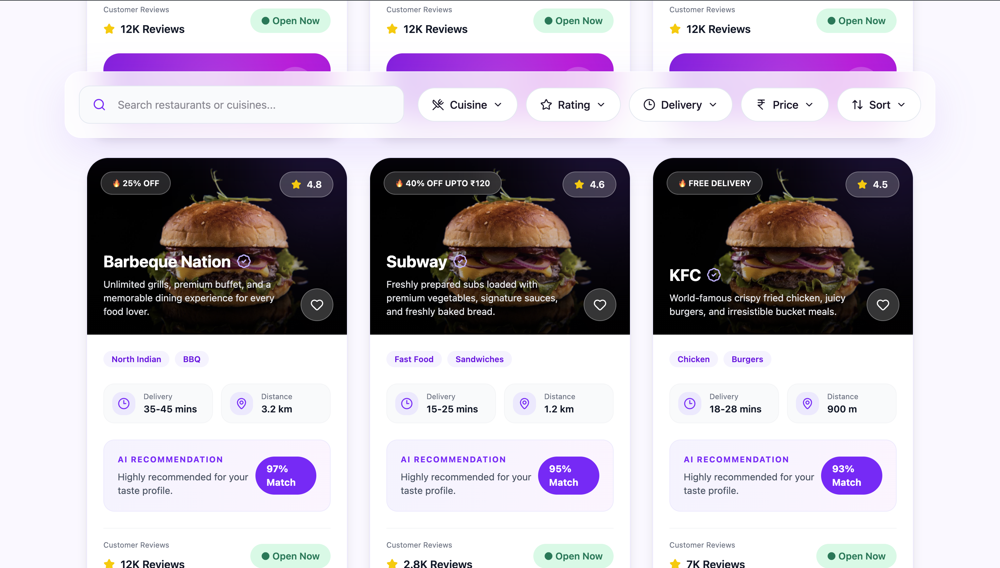
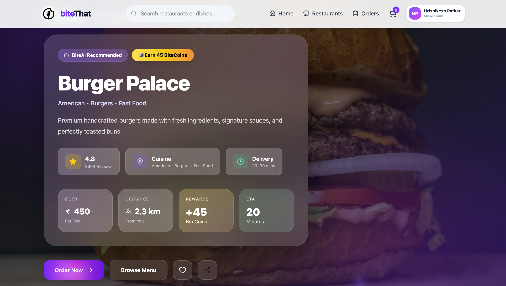
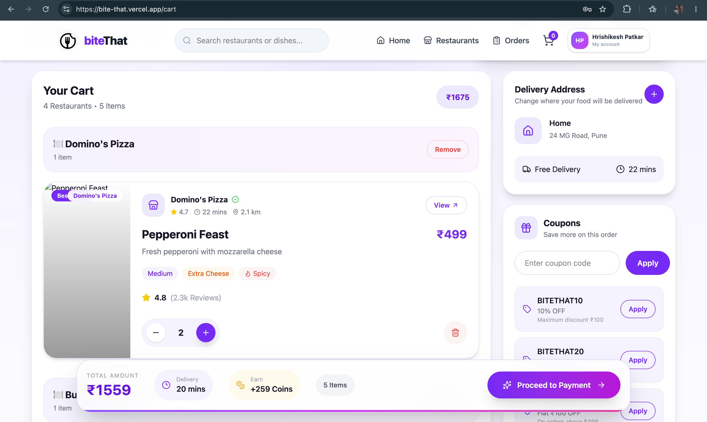
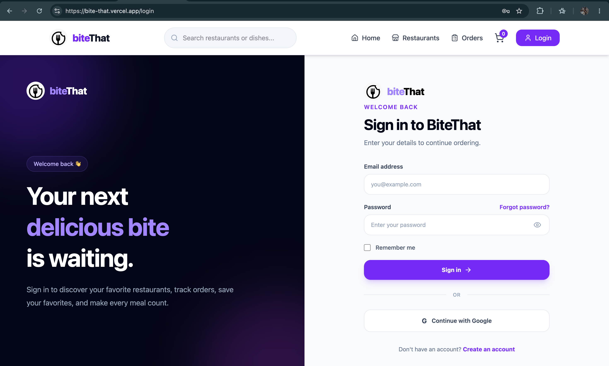
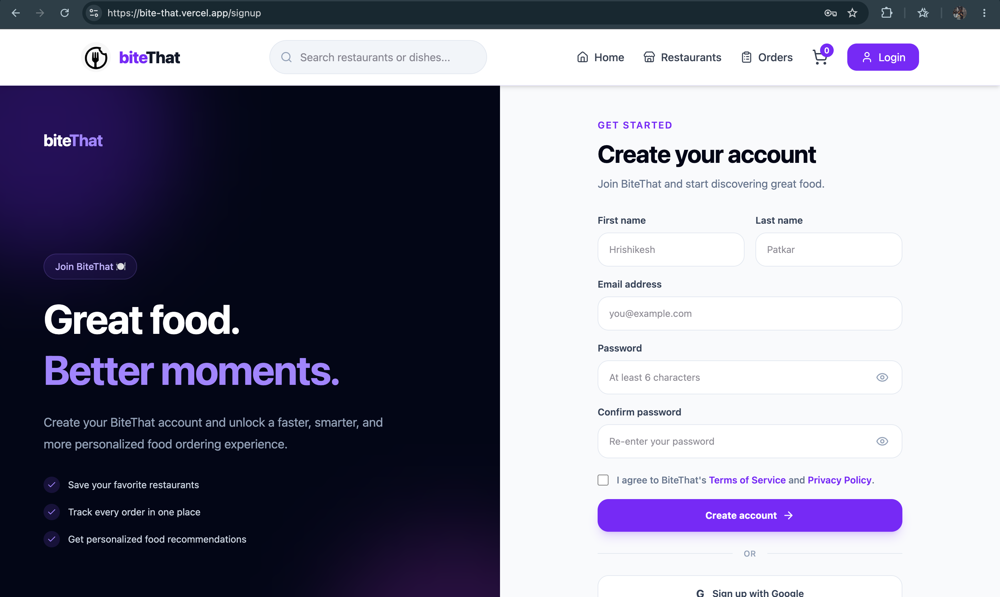
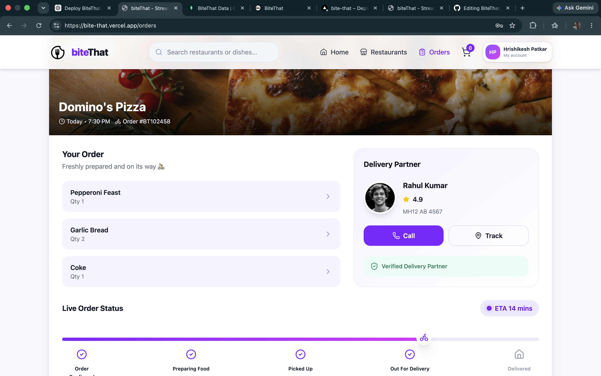
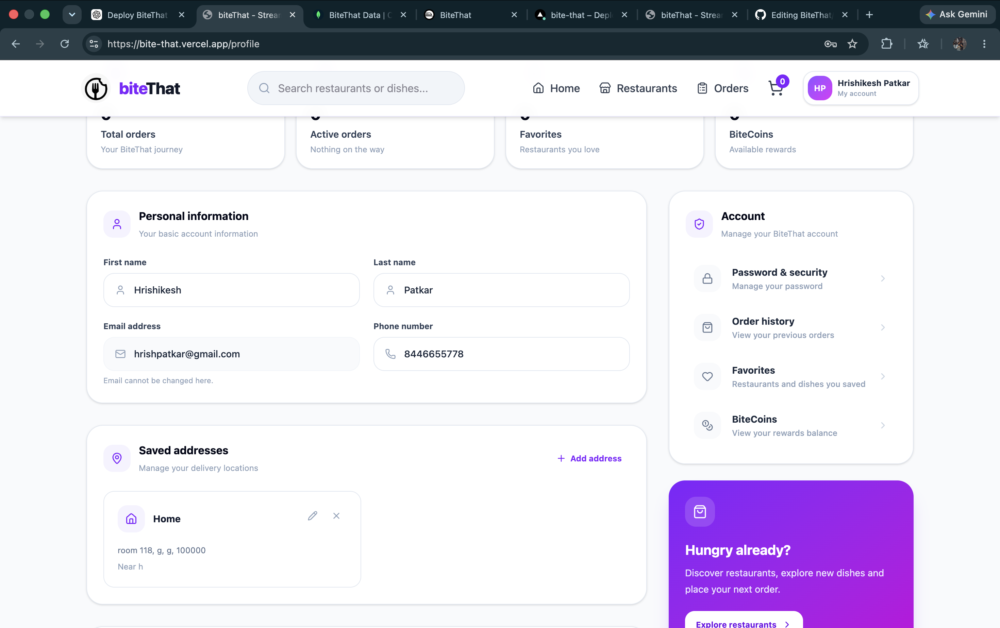

# 🍽️ BiteThat

BiteThat is a full-stack food ordering web application built using **React, Node.js, Express.js, and MongoDB**.

Users can browse restaurants and menus, manage their cart, create an account, log in, manage their profile and addresses, and view their orders.

The application is deployed using **Vercel**, **Railway**, and **MongoDB Atlas**.

---

# 📸 Screenshots

### Home Page


### Restaurant Listing


### Restaurant Details


### Cart


### Login


### Signup


### Orders


### Profile


---

# 🌐 Hosted URL

### Live Website

**https://bite-that.vercel.app**

---

# ✨ Features Implemented

## - Frontend

### Home Page

* Responsive landing page
* Hero section
* Browse by cuisines
* Top Picks section
* Featured restaurant section
* Offer banner
* Why Choose BiteThat section
* Testimonials
* Navbar and footer

### Restaurant Listing

* Restaurant listing page
* Search and filter interface
* Cuisine filters
* Rating filter
* Delivery filter
* Price filter
* Sorting
* Cuisine chips
* Restaurant cards

### Restaurant Details

* Restaurant information
* Offers section
* Popular dishes
* Categorized menu
* Add-to-cart functionality
* Reviews section
* Restaurant gallery
* Similar restaurants
* Floating cart
* Menu loading states

### Cart

* Add items to cart
* Change item quantity
* Remove items
* Subtotal calculation
* Delivery fee calculation
* Tax calculation
* Discounts
* Coupon codes
* BiteCoins interface
* Delivery address section
* Add-on food section
* Order summary
* Checkout interface

### Authentication

* User signup
* User login
* Logout
* Persistent authentication
* Forgot password
* Verification code
* Reset password
* Change password

### Profile

* View user profile
* Update profile information
* Manage phone number
* Add saved addresses
* Update saved addresses
* Delete saved addresses
* Change password
* Order/profile statistics

### Orders

* Current orders
* Past orders
* Cancelled orders
* Order status
* Delivery progress UI
* Estimated delivery time
* Cancel order
* Reorder interface

### UI

* Responsive design
* Tailwind CSS styling
* Framer Motion animations
* Toast notifications
* Skeleton loading states
* Carousels
* Responsive grids

---

# ⚙️ Backend

The backend is built using **Node.js and Express.js**.

## Authentication

* Register user
* Login user
* JWT authentication
* Password hashing using bcrypt
* Get currently authenticated user
* Update user profile
* Forgot password
* Verify password reset code
* Reset password
* Change password

## Address Management

* Add address
* Get saved addresses
* Update address
* Delete address

## Orders

* Order API
* Retrieve user orders
* Cancel order
* Profile/order statistics endpoints

## Restaurant Backend

* Restaurant API routes
* Restaurant controller
* Restaurant service/provider
* Restaurant data provided to the frontend

## Database

**MongoDB Atlas** is used as the database with **Mongoose**.

The backend stores data including:

* Users
* Saved addresses
* Orders

## Email

**Resend** is used for the password recovery system.

It handles the email verification code used during the forgot-password/reset-password flow.

## Security

* Password hashing with bcrypt
* JWT authentication
* Authentication middleware
* Environment variables for secrets
* CORS configuration

---

# 🤖 Machine Learning

A dedicated machine-learning model has **not been implemented** in the current version of BiteThat.

The application contains recommendation-style UI sections such as food and restaurant recommendations, but these should not be considered a trained machine-learning recommendation system.

A real recommendation model can be integrated in a future version.

---

# 🛠️ Technologies / Libraries / Packages Used

## - Frontend

* React
* Vite
* JavaScript
* Tailwind CSS
* React Router DOM
* Axios
* Framer Motion
* Lucide React
* React Hook Form
* React Hot Toast
* clsx

## - Backend

* Node.js
* Express.js
* MongoDB
* Mongoose
* bcryptjs
* jsonwebtoken
* cors
* cookie-parser
* dotenv
* Axios
* Resend
* Nodemon

## - Deployment

* Vercel – Frontend
* Railway – Backend
* MongoDB Atlas – Database

---

# 📁 Project Structure

```text
BiteThat/
│
├── client/
│   ├── src/
│   │   ├── assets/
│   │   ├── components/
│   │   ├── context/
│   │   ├── data/
│   │   ├── features/
│   │   ├── pages/
│   │   └── services/
│   │
│   ├── package.json
│   └── vite.config.js
│
├── server/
│   ├── config/
│   ├── controllers/
│   ├── middleware/
│   ├── models/
│   ├── routes/
│   ├── services/
│   ├── server.js
│   └── package.json
│
├── .gitignore
└── README.md
```

---

# 💻 Local Setup

## 1. Clone the Repository

```bash
git clone https://github.com/hrxsh-io/BiteThat.git
cd BiteThat
```

---

## 2. Setup Backend

Move to the backend:

```bash
cd server
```

Install dependencies:

```bash
npm install
```

Create a `.env` file inside `server/`:

```env
PORT=5001
MONGO_URI=YOUR_MONGODB_CONNECTION_STRING
JWT_SECRET=YOUR_JWT_SECRET
RESEND_API_KEY=YOUR_RESEND_API_KEY
GOOGLE_PLACES_API_KEY=YOUR_GOOGLE_PLACES_API_KEY
```

Do not commit `.env` or API keys to GitHub.

Start the backend:

```bash
npm run dev
```

The backend runs locally at:

```text
http://localhost:5001
```

---

## 3. Setup Frontend

Open another terminal.

From the BiteThat directory:

```bash
cd client
npm install
npm run dev
```

The frontend runs locally at:

```text
http://localhost:5173
```

---

# 🚀 Deployment

The deployed application uses:

```text
                    BiteThat
                       │
              ┌────────┴────────┐
              │                 │
           Frontend          Backend
              │                 │
           Vercel            Railway
                                │
                          MongoDB Atlas
```

### Frontend

Hosted on **Vercel**.

**https://bite-that.vercel.app**

### Backend

Hosted on **Railway**.

### Database

Hosted using **MongoDB Atlas**.

---

# 👥 Team Members

* **Hrishikesh Patkar**
* **Aryan Thadani**

---

# 📌 Project Status

BiteThat is deployed and publicly accessible.

### Live Application

**https://bite-that.vercel.app**
